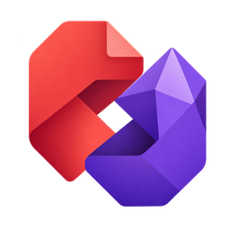

# Zotero–Obsidian Connector

Zotero 논문을 Obsidian Markdown 노트로 자동 생성하고 양쪽 앱을 연결하는 플러그인입니다.

## 시작하기

1. [릴리스 페이지](https://github.com/kimstitute/zotero-obsidian-connector/releases/latest)에서 `.xpi` 파일을 받습니다. Zotero 9.0.x의 **도구 → 플러그인 → 톱니바퀴 → 파일에서 플러그인 설치**에서 XPI를 선택합니다. 소스 코드 ZIP은 설치 파일이 아닙니다.
2. **도구 → Zotero–Obsidian Connector: Configure…**를 엽니다.
3. `.obsidian` 폴더가 들어 있는 보관함의 전체 경로를 입력합니다.
4. 보관함 안의 노트 폴더를 입력합니다. 예: `Papers`, `Research/Papers`.
5. 노트 폴더의 `dashboard.md`에서 논문 제목을 누르면 해당 노트가 열립니다.

Zotero 논문 우클릭의 **Open in Obsidian**으로 노트를 열고, 노트의 **Open in Zotero**로 돌아갑니다. 개인 및 로컬 그룹 라이브러리의 일반 서지 항목이 대상입니다. 설정 전에는 파일을 생성하지 않습니다.

자동 동기화를 사용하려면 Zotero를 실행해 두세요. 수동 갱신은 **도구 → Sync literature notes to Obsidian**, 대시보드 열기는 **도구 → Open literature dashboard in Obsidian**을 사용합니다. Obsidian에는 별도 플러그인을 설치하지 않아도 됩니다.

Obsidian 읽기 모드에서는 제목과 링크를 클릭하면 됩니다. 편집 모드에서는 Ctrl+클릭(macOS는 Cmd+클릭)을 사용하거나 읽기 모드로 전환하세요. 외부 앱 열기 확인창이 나타나면 해당 앱으로 이동을 허용합니다.

## 메모 보존

Zotero에서 논문 노트나 대시보드를 열면 **Obsidian의 새 탭**에서 열립니다. 현재 탭의 문서는 그대로 유지됩니다.

자동 생성 주석 사이에는 서지정보와 초록이 갱신됩니다. 직접 작성할 내용은 **My notes** 아래에 적으세요. 기존 메모를 지키려면 자동 생성 주석을 유지해야 합니다.

논문을 삭제해도 메모 파일은 남습니다. 대시보드에서는 삭제된 논문이 제외됩니다. 동일 폴더 안에서 파일명을 바꾼 뒤 전체 동기화를 실행하면 링크가 갱신됩니다. 다른 폴더로 이동하는 것은 지원하지 않습니다.

기존에 다른 연동 플러그인을 사용했다면 같은 폴더를 대상으로 두 플러그인이 동시에 쓰지 않도록 이전 플러그인을 비활성화하세요. 저장 위치를 바꿔도 기존 파일은 이동하지 않습니다.

## 개발 및 배포

`npm test`로 테스트하고 `python scripts/build.py`로 XPI를 생성합니다. 공개 GitHub 배포 시에는 `--repository OWNER/REPOSITORY`를 지정하세요. [배포 안내](RELEASING.md)

공개용 초기 버전입니다. Windows에서 실제 동기화, 메모 보존, 파일명 변경, Obsidian 문서 열기를 확인했고 자동 테스트 11개가 통과했습니다. 일부 UI 클릭 흐름과 macOS/Linux는 추가 검증이 필요합니다. [검증 범위](VALIDATION.md)

코드에는 개인 보관함 경로나 실제 논문 목록이 포함되지 않습니다. 사용 중 생성되는 노트·설정·오류 로그는 개인 데이터를 포함할 수 있으니 공개 저장소에 올리지 마세요.
